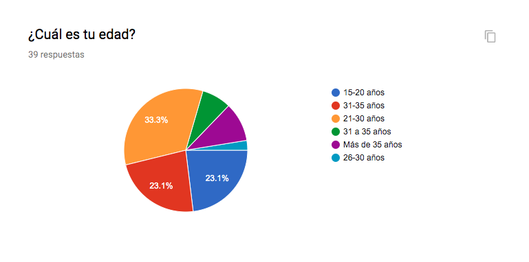
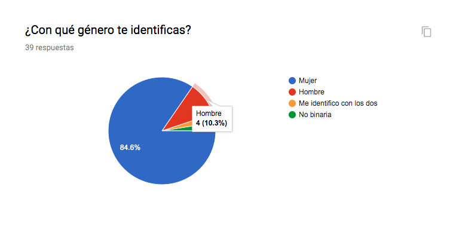
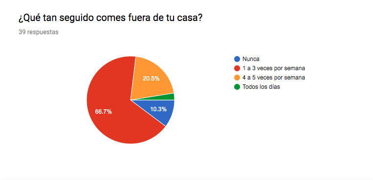
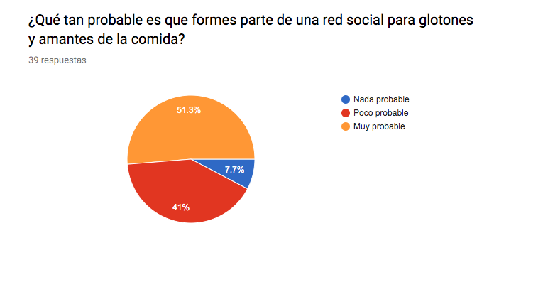

# Creando una Red Social

## FoodLova

## Índice

* [1. Introducción](#Introduccón)
* [2. Definición del producto](#Definicion-del-producto)
* [3. User persona](#User-persona)
* [4. Historia de usuario](#Historia-de-usuario)

## Introducción
​
FoodLova es la red social para tod@s los amantes de la comida en la CDMX. La red que te permite conectar con tus amigos o FoodLovas  para saber qué lugares frecuentan cuando van a comer, calmar la tripa y saciar ese antojo mortal. 
​
En FoodLova podrás compartir tus mejores recomendaciones y las peores; revisar cuáles son los lugares más frecuentados por tus amigos y por supuesto, presumir esa torta gigante que cenaste en lunes por la noche. FoodLova es la red de confianza para saber con seguridad cuáles tacos realmente van a calmar la tripa sin enflacar tu cartera.
​
## Definición del producto
​
Se realizaron 39 encuestas que nos permitieron conocer con qué probabilidad los usuarios serían parte de una red de glotones, y con qué frecuencia comían fuera de casa.
La mayoría de nuestros encuestados fueron mujeres, que asisten a la escuela, y comen fuera de casa la mayoría de las veces.
​

​
El 33.3% de los encuestados se encuentran entre los 21-30 de edad.
​

​
El 84.6% de los encuestados son mujeres miestras que el 10.3% son hombres
​

​
El 66.7% de los encuestados comen de 1 a 3 veces por semana fuera de sus casas.
​

El 51.3% de los encuestados les interesaria formar parte de una red social para amantes de la comida
​

​
El 28.2% de nuestros encuestados son estudiantes por lo cual no les da tiempo de comer en casa o preparse algo de comida para llevar.
​
## User persona
​

Fernanda es una estudiante de 25 años, actualmente se encuentra cursando el bootcamp de Laboratoria. Debido a que Fernanda no cuenta con mucho tiempo ni dinero para hacer sus compras en el super y prepararse su comida en casa, ella come con mucha frecuencia en la calle, en lugares que se encuentran cerca de su lugar de estudio.

## Historia de usuario

Como usuaria quiero tener la opción de crear una cuenta nueva o iniciar sesión con una cuenta ya existente

Como usuaria quiero poder crear mi cuenta utilizando mis datos de Facebook, Google o con mi correo electrónico

Como usuario quiero iniciar sesión con las opciones de Facebook, Google o mi correo electrónico.

Como usuaria quiero poder ver el muro y las publicaciones recientes.

Como usuario quiero poder hacer una publicación en el muro de mi red.

Como usuario quiero poder subir fotos o imágenes para compartir mi experiencia.

Como usuario quiero tener la opción de editar o eliminar alguna publicación que haya hecho.

Como usuaria quiero darle like a una publicación de mi agrado.

Como usuaria quiero poder agregar algún comentario en publicaciones de amigos dentro de mi red.

Como usuaria quiero poder ver en un mapa los lugares cercanso para ir a comer.

Como usuaria quiero poder filtrar mi búsqueda, según el tipo de comida.

​
## Prototipo de baja fidelidad

[Marvel](https://marvelapp.com/42ie94h/screen/59883665)

## Prototipo de alta fidelidad

[Marvel](https://www.figma.com/proto/6NuxSKHA0Lz8jx2jBcDAUJ/FoodLova?node-id=2%3A10&scaling=scale-down)